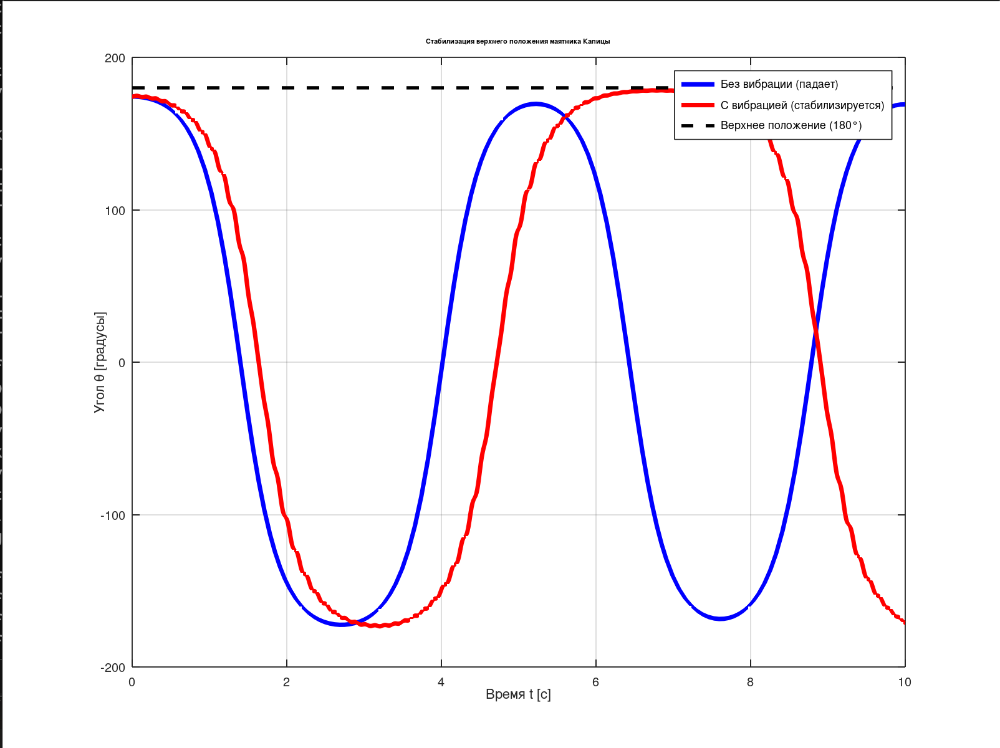

# Маятник Капицы — Динамическая стабилизация

Численное моделирование маятника Капицы с вибрирующим подвесом. Демонстрация эффекта динамической стабилизации верхнего положения равновесия при высокочастотных колебаниях точки подвеса.

## Результат моделирования

На графике показано:
- **Синяя линия** — обычный маятник без вибрации (неустойчивое положение, маятник падает)
- **Красная линия** — маятник с вибрацией подвеса (стабилизируется в верхнем положении)
- **Пунктир** — верхнее положение равновесия (180°)

## Основные уравнения

Уравнение движения маятника Капицы:
